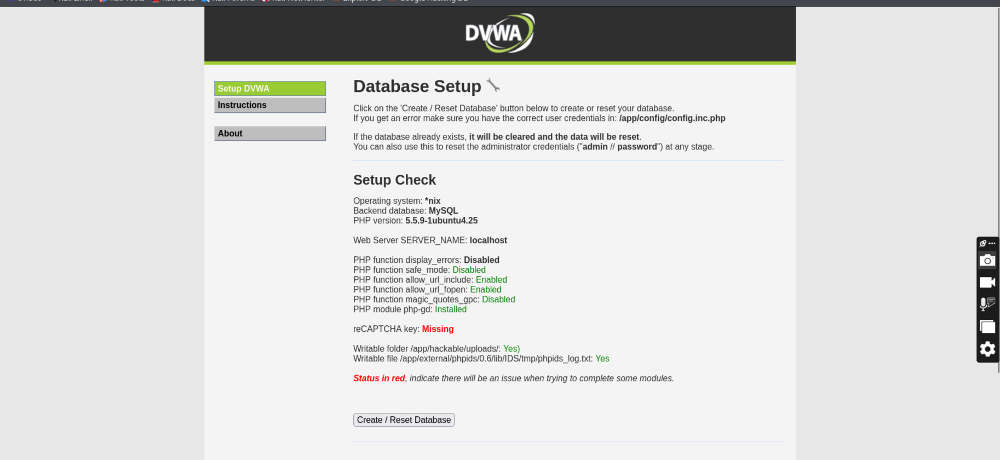
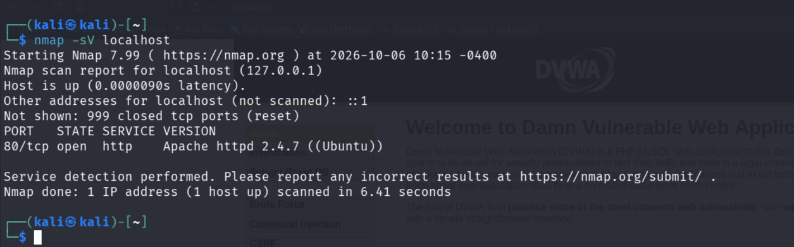
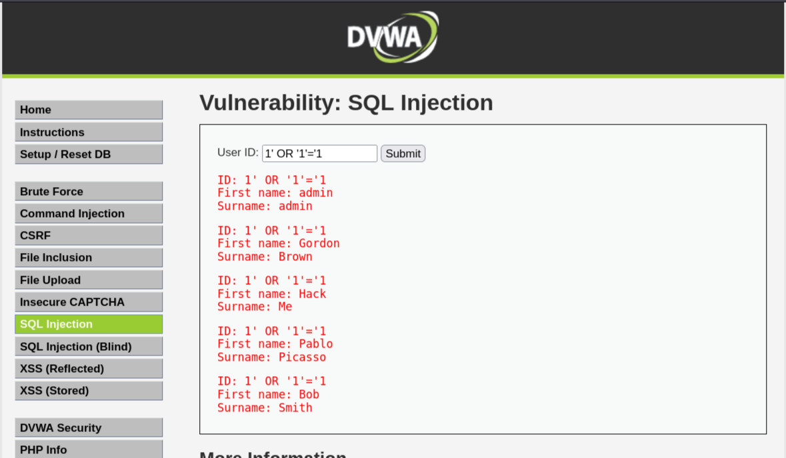
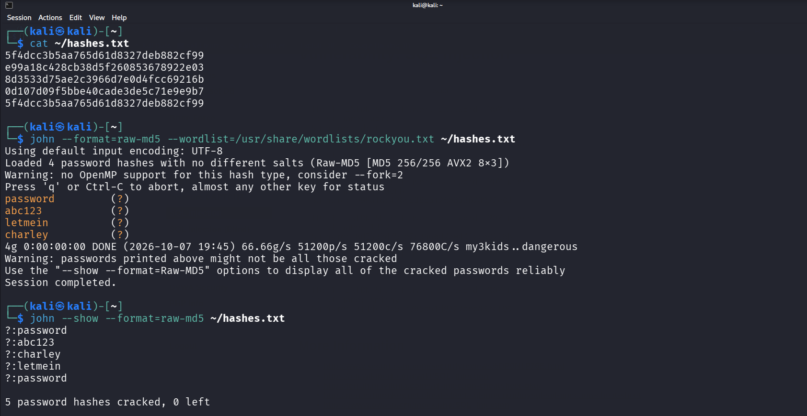
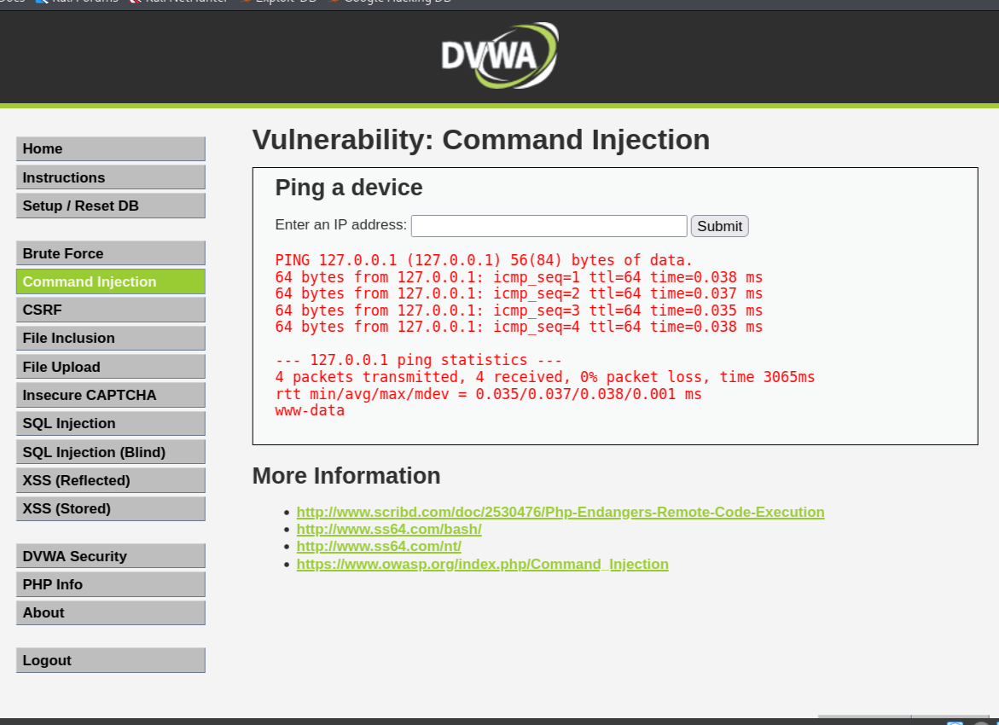
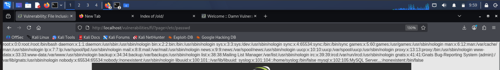
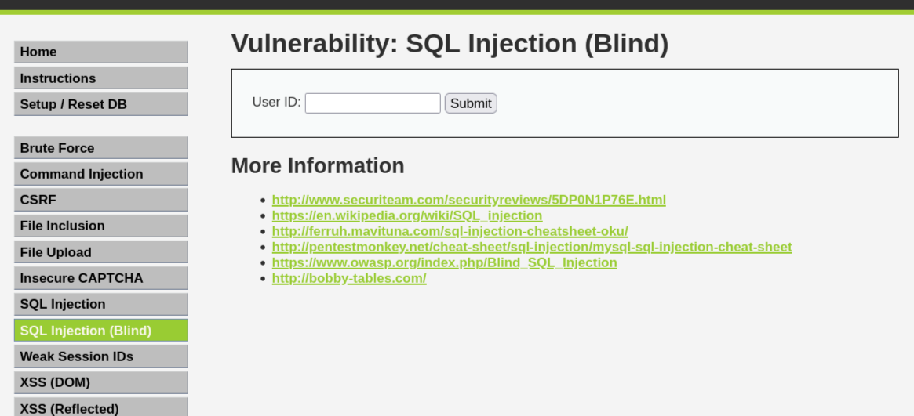
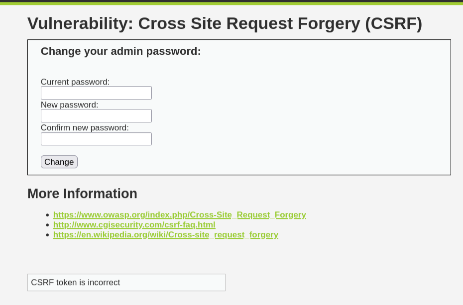

# 🔐 DVWA Full Lifecycle Assessment

**Web Application Penetration Test — From Exploitation to Remediation**

---

**Author:** Muhammad Muhsin Khamis  
**Program:** BSc Cybersecurity  
**Project Type:** Self-Directed Portfolio Project  
**Target:** DVWA (Damn Vulnerable Web Application) v1.9  
**Environment:** Self-hosted in Kali Linux via Docker  
**Assessment Type:** Full Black-Box Web Application Penetration Test  
**Date:** October 2026  

**Overall Risk Rating:** 🔴 **CRITICAL**

---

## Why I Built This

I wanted a project that would cover the full penetration testing lifecycle — 
not just finding a vulnerability, but exploiting it, documenting it, and 
then proving the fix works.

DVWA was my target. This repository is the complete result.

---

## What This Project Covers

DVWA is a deliberately vulnerable PHP/MySQL application designed for 
security training. I set it up in my own isolated lab and assessed it 
end-to-end.

The project has five phases:

1. **Reconnaissance** — Identify services, technologies, and attack surface
2. **Exploitation** — Find and exploit 9 vulnerabilities
3. **Reporting** — Produce a professional pentest report
4. **Remediation** — Apply fixes to close the vulnerabilities
5. **Re-Test** — Verify the fixes actually work

---

## Tools I Used

| Tool | Purpose |
|---|---|
| Kali Linux | Testing environment |
| Docker | Lab deployment (DVWA container) |
| Nmap | Port scanning and service detection |
| WhatWeb | Web technology fingerprinting |
| Nikto | Web server misconfiguration scanning |
| Gobuster | Directory and file enumeration |
| Firefox | Manual application testing |
| curl | HTTP request analysis |
| John the Ripper | Password hash cracking |
| rockyou.txt | Dictionary wordlist |
| CrackStation / Hashes.com | Online hash lookup |

---

## Lab Setup

DVWA was deployed as a Docker container on Kali Linux.



---

## Reconnaissance

Initial reconnaissance identified the attack surface — only port 80 
was exposed, running Apache 2.4.7 and PHP 5.5.9.



---

## Vulnerabilities Found

| # | Vulnerability | Severity | CVSS |
|---|---|---|---|
| 1 | Brute Force — No rate limiting | 🟠 High | 7.5 |
| 2 | Command Injection — OS command execution | 🔴 Critical | 9.8 |
| 3 | CSRF — Password change via GET | 🟠 High | 7.1 |
| 4 | File Inclusion — Arbitrary file read | 🟠 High | 8.6 |
| 5 | File Upload — Unrestricted PHP upload | 🔴 Critical | 9.8 |
| 6 | SQL Injection — Database extraction | 🔴 Critical | 9.8 |
| 7 | SQL Injection (Blind) — Boolean inference | 🟠 High | 7.5 |
| 8 | XSS (Reflected) — JavaScript injection | 🟡 Medium | 6.1 |
| 9 | XSS (Stored) — Persistent JavaScript | 🟠 High | 8.2 |

**Total:** 3 Critical, 4 High, 1 Medium, 1 Low

---

## The Attack Chain

Each vulnerability is serious on its own. But the real lesson is what 
happens when they chain together:

```
Reconnaissance
    ↓
Information Disclosure (X-Powered-By, outdated software)
    ↓
SQL Injection → Database extraction
    ↓
Password Cracking → Full authentication bypass
    ↓
File Upload → Remote code execution
    ↓
Command Injection → Server compromise
    ↓
File Inclusion → Source code extraction
```

The SQL injection alone is critical. But combined with weak hashing and 
weak user passwords, it becomes a full-scale compromise.

---

## Proof of Concept — SQL Injection

The `id` parameter in the SQL Injection module is inserted directly into 
a database query. Using a UNION-based attack, I dumped the entire users 
table.



**Extracted users and cracked passwords:**

| Username | MD5 Hash | Cracked Password |
|---|---|---|
| admin | 5f4dcc3b5aa765d61d8327deb882cf99 | password |
| gordonb | e99a18c428cb38d5f260853678922e03 | abc123 |
| 1337 | 8d3533d75ae2c3966d7e0d4fcc69216b | charley |
| pablo | 0d107d09f5bbe40cade3de5c71e9e9b7 | letmein |
| smithy | 5f4dcc3b5aa765d61d8327deb882cf99 | password |

All 5 hashes were cracked in under 30 seconds using John the Ripper and 
rockyou.txt.



---

## Proof of Concept — Command Injection

The IP field in the Command Injection module passes input directly to 
the OS shell. By submitting `127.0.0.1; whoami`, I executed a command 
on the server.



The output `www-data` is the web server user — confirming remote code 
execution.

---

## Proof of Concept — File Inclusion

By changing the URL to `?page=/etc/passwd`, I read system files through 
the web app.



The full `/etc/passwd` file was returned — every system user visible 
through a browser.

---

## Remediation and Re-Test

After exploitation, I applied remediation by switching DVWA to security 
level = **Impossible**. Then I re-tested every exploit to confirm it was 
blocked.

| # | Vulnerability | Fix Applied | Re-Test |
|---|---|---|---|
| 1 | Brute Force | Rate limiting | ✅ Blocked |
| 2 | Command Injection | Input whitelist | ✅ Blocked |
| 3 | CSRF | CSRF tokens | ✅ Blocked |
| 4 | File Inclusion | Page whitelist | ✅ Blocked |
| 5 | File Upload | Extension validation | ✅ Blocked |
| 6 | SQL Injection | Prepared statements | ✅ Blocked |
| 7 | SQL Injection (Blind) | Prepared statements | ✅ Blocked |
| 8 | XSS (Reflected) | Output encoding | ✅ Blocked |
| 9 | XSS (Stored) | Output encoding | ✅ Blocked |

All 9 vulnerabilities were confirmed closed during re-testing.

**Proof — SQL Injection blocked at Impossible level:**



**Proof — CSRF blocked with token validation:**



---

## Full Report

The complete penetration testing report — executive summary, all 9 
findings with evidence, risk ratings, and remediation guidance — is 
available as a PDF in this repository:

📄 **[DVWA-Penetration-Test-Report.pdf](DVWA-Penetration-Test-Report.pdf)**

---

## What I Learned

**1. Vulnerabilities compound.** A single SQL injection is critical. But 
when it leads to hashes, which lead to cracked passwords, which lead to 
authenticated access — the impact explodes.

**2. Defense in depth is real.** No single fix would have protected this 
application. It took prepared statements AND output encoding AND rate 
limiting AND input validation to close every finding.

**3. Documentation is a skill.** Finding a vulnerability is only half the 
work. Explaining it clearly — in a way a non-technical reader can 
understand — is just as important.

**4. Re-testing proves the work.** Anyone can claim they fixed something. 
Proving it with the same exploit that worked before is what separates a 
real assessment from a guess.

**5. Offensive knowledge makes better defenders.** Understanding exactly 
how these attacks work is what makes it possible to prevent them.

---

## Ethical Statement

This penetration test was conducted against **DVWA** — a deliberately 
vulnerable application hosted in an isolated personal lab environment.

- ✅ No real systems were targeted
- ✅ No unauthorised access occurred
- ✅ All testing was against a self-owned lab
- ✅ All findings are documented for educational purposes

**All techniques documented here are for education only.** Using them 
against systems you do not own or do not have explicit written 
authorisation to test is **illegal in most countries**.

If you are learning cybersecurity, do what I did — build your own lab.

---

## References

- [OWASP Top 10](https://owasp.org/www-project-top-ten/)
- [DVWA Official](https://github.com/digininja/DVWA)
- [PTES](http://www.pentest-standard.org/)
- [OWASP Testing Guide](https://owasp.org/www-project-web-security-testing-guide/)
- [CrackStation](https://crackstation.net/)

---

## Author

**Muhammad Muhsin Khamis**  
Cybersecurity Student

- 🐙 GitHub: [@MuhseenMK](https://github.com/MuhseenMK)
- 💼 LinkedIn: [Muhammad Muhsin Khamis](https://www.linkedin.com/in/muhammad-muhsin-khamis-9860b3311/)
- 📧 Email: khamismuhammadmuhsin@gmail.com

---

## Project Metadata

| Item | Value |
|---|---|
| Project Type | Self-Directed Lab |
| Category | Web Application Penetration Testing |
| Difficulty | Beginner → Intermediate |
| Duration | 5–7 days |
| Report Reference | DVWA-PT-2026-01 |
| Classification | Educational / Internal |

---

*The best way to learn to defend a system is to learn how to break it.*
```

---

